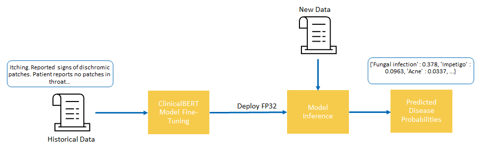
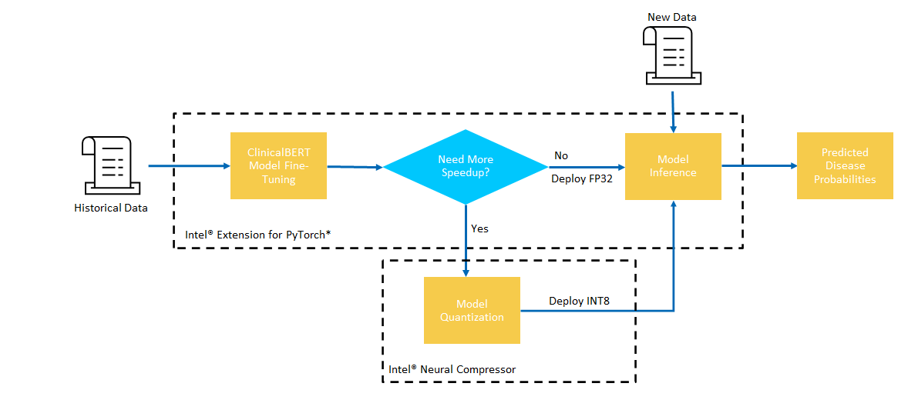
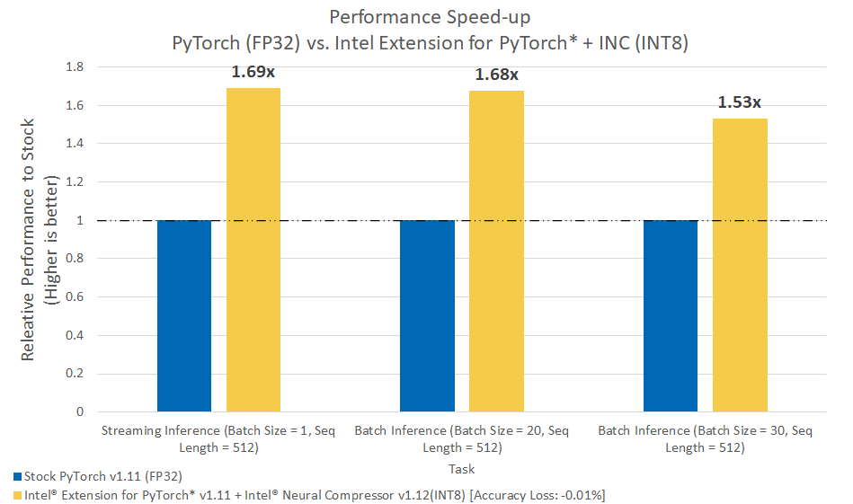

# **PyTorch NLP Based Disease Prediction**

## **Table of Contents**
 - [Purpose](#purpose)
 - [Reference Solution](#reference-solution)
 - [Reference Implementation](#reference-implementation)
 - [Intel® Optimized Implementation](#optimized-e2e-architecture-with-intel%C2%AE-oneapi-components)
 - [Performance Observations](#performance-observations)
 - [Experimental Setup](#experiment-setup)

## Purpose

 The typical hospital generates 50 petabytes of data each year, much of which is unstructured or semi-structured and trapped in the notes sections of electronic health records (EHR) systems, not readily available for analysis.  To gain a more comprehensive picture of patient health from unstructured data, healthcare payers routinely resort to expensive chart reviews in which clinical professionals manually comb through patient records in search of nuggets of useful information which can help them assign appropriate risk categories to each patient. The difference between an incorrect code and a correct code can cost millions of dollars per year per patient. Payers are beginning to use natural language processing (NLP) to understand nuanced language within a body of text to improve risk adjustment, reduce costs, and enhance patient care. 

 NLP has been used as a tool by healthcare providers for some time but NLP investment by healthcare payers is increasing rapidly. With the development of new techniques in NLP via Deep Learning, significant interest has been drawn by healthcare payers to the task of building AI systems capable of sifting through complex notes and documents within an EHR to assess patient state.  

 In this reference kit, we demonstrate one possible reference implementation of a Deep Learning based NLP pipeline which aims to train a document classifier that takes in notes about a patients symptoms and predicts the diagnosis among a set of known diseases.  This is further accelerated by Intel® OneAPI to speed up training, enabling healthcare payers to increase risk assessment accuracy and run training more frequently to incorporate constantly changing data, in addition to process the massive datasets more efficiently on Intel® hardware.
 
## Reference Solution

The implementation for our AI-based NLP Disease Prediction system is based around fine-tuning and using a ClinicalBERT-based document classifier.  The pipeline ingests text statements/documents and outputs the probability of diagnoses for a known set of diseases.

> Patient Document/Notes => **Classify Document to Predicted Disease** => Measured Patient Level Risk

Given a set of documents, such as doctors notes or a list of patient systems, the implemented AI system must understand the context of document and ultimately map this to the disease that the document is most likely describing.  As documents are often written by a human using Natural Language descriptions, a powerful model which takes these into account is necessary for good performance.  Here, we choose to implement such a classifier using a Deep Learning based NLP model.  Specifically, we fine tune a pre-trained ClinicalBERT embeddings to perform document classification.  ClinicalBERT embeddings are a specialization of classical BERT embeddings to know about clinical jargon, which is a specific intricacy of medical NLP applications.

## Key Implementation Details

The reference kit implementation is a reference solution to the described use case that includes:

  1. A reference E2E architecture to arrive at an AI solution with PyTorch using ClinicalBERT
  2. An Optimized reference E2E architecture enabled with Intel® Extension for PyTorch* and Intel® Neural Compressor available as part of Intel® AI Analytics Toolkit. 

## Reference Implementation

### E2E Architecture



### Expected Input-Output

**Input**                                 | **Output** |
| :---: | :---: |
| Patient Summary Text          | For each disease $d$, the probability [0, 1] that patient suffers from disease $d$ |

**Example Input**                                 | **Example Output** |
| :---: | :---: |
| Itching. Reported signs of dischromic patches. Patient reports no patches in throat. Issues of frequent skin rash. Patient reports no spotting urination. Patient reports no stomach pain. nodal skin eruptions over the last few days. | {'Fungal infection' : 0.378, 'Impetigo' : 0.0963, 'Acne' : 0.0337, ...}

### Dataset

The dataset used for this demo is a synthetic symptom and diagnosis dataset obtained from https://www.kaggle.com/kaushil268/disease-prediction-using-machine-learning.  In this dataset, each row corresponds to a list of symptom names and the corresponding diagnosis for that particular set of syptoms.  The original dataset consists of indicators for the symptom names however for our purposes, we first transform the data from indicators to string descriptions to emulate a situation where the symptoms come in the form of text.  An example row would be 


> symptoms: itching, dischromic patches, nodal skin eruptions, skin rash
> diagnoses: fungal infection

Furthermore, to add a bit of natural language variation, each list of symptoms is padded with a few random phrases to imitate the possible situation of noise and a few negative phrases as well.  For example, a possible variation of above list of symptoms could be.

> symptoms:  Itching. Reported signs of dischromic patches. Patient reports no patches in throat. Issues of frequent skin rash. Patient reports no spotting urination. Patient reports no stomach pain. nodal skin eruptions over the last few days.

**To download and setup this dataset for benchmarking, follow the instructions listed in the data directory [here](data/README.md).**

> **Please see this data set's applicable license for terms and conditions. Intel Corporation does not own the rights to this data set and does not confer any rights to it.**

### Model Training

Using the patient symptom descriptions and diagnoses, we train a fine-tuned ClinicalBERT model for text classification, ingesting free-form symptom description text and outputting the predicted diagnosis probabilities of the provided text.  ClinicalBERT is a set of pre-trained embeddings with a focus on medical terminology and allows our model to be better prepared for medical contexts. The trained model follows the simple pipeline of 

> Patient Document/Notes/Symptom Description => **ClinicalBERT w/ Classification Head** => Predicted Disease Probabilities

Details about the BERT model can be found at (Devlin 2018)[1].  Details about the ClinicalBERT embeddings can be found at (Alsentzer 2019).

[1] Devlin, Jacob, et al. "Bert: Pre-training of deep bidirectional transformers for language understanding." arXiv preprint arXiv:1810.04805 (2018).

[2] Alsentzer, Emily, et al. "Publicly available clinical BERT embeddings." arXiv preprint arXiv:1904.03323 (2019).

### Model Inference

The saved model from the model training process can be used to predict the disease probabilities from a new NLP symptom string.

### Software Requirements

1. Python
2. PyTorch v1.11

To run this reference kit, first clone this repository, which can be done using

```shell
git clone https://www.github.com/oneapi-src/disease-prediction
```

This reference kit implementation already provides the necessary scripts to setup the above software requirements. To utilize these environment scripts, first install Anaconda/Miniconda by following the instructions at the following link

https://docs.conda.io/projects/conda/en/latest/user-guide/install/index.html

### Reference Solution Setup

The `setupenv.sh` can be used to automate the creation of a conda environment for execution of the algorithms using the statements below.

```shell
bash setupenv.sh
1. stock
2. intel
? 1
```

This script utilizes the dependencies found in the `env/stock/stock.yml` file to create an environment as follows:

**YAML file**                                 | **Environment Name** |  **Configuration** |
| :---: | :---: | :---: |
| `env/stock/stock.yml`             | `disease_pred_stock` | Python=3.8.x with PyTorch v1.11 |

For the workload implementation to arrive at first level reference solution we will be using the stock environment

### Reference Implementation

#### Model Building Process

The NLP Disease Prediction model is based on utilizing the ClinicalBERT pre-trained embeddings along with a classification head to bring in medical domain knowledge as well as fine-tuned features.  In order to train the model, run the `run_training.py` script, which *reads and preprocesses the data*, *trains a Clinical BERT based NLP Classifier*, and saves the model for future use.

The run training script takes the following arguments:

```shell
usage: run_training.py [-h] --data_dir DATA_DIR [--logfile LOGFILE] [--intel] [--save_model_dir SAVE_MODEL_DIR] [--seq_length SEQ_LENGTH] [--batch_size BATCH_SIZE] [--epochs EPOCHS] [--grad_norm GRAD_NORM] [--bert_model BERT_MODEL]

optional arguments:
  -h, --help            show this help message and exit
  --data_dir DATA_DIR   Directory with Training.csv and Testing.csv
  --logfile LOGFILE     Log file to output benchmarking results to.
  --intel               Use intel accelerated technologies where available.
  --save_model_dir SAVE_MODEL_DIR
                        Directory to save model under.
  --seq_length SEQ_LENGTH
                        Sequence length to use when training.
  --batch_size BATCH_SIZE
                        Batch size to use when training.
  --epochs EPOCHS       Number of training epochs.
  --grad_norm GRAD_NORM
                        Gradient clipping cutoff.
  --bert_model BERT_MODEL
                        Bert base model to fine tune.
```

An example of running the training for this model looks like.
```shell
cd src
conda activate disease_pred_stock
python run_training.py --logfile ../logs/stock.log --save_model_dir ../saved_models/stock --data_dir ../data/disease-prediction
```

which will output a saved model at `saved_models/stock` and log timing information to `logs/stock.log`.

### Running Inference

After the model is trained and saved as a `.pt` file using the above script, it can be loaded to make predictions on new data using the `run_inference.py`.  This script takes the following arguments:

```shell[y]
usage: run_inference.py [-h] --saved_model_dir SAVED_MODEL_DIR --input_file INPUT_FILE [--batch_size BATCH_SIZE] [--benchmark_mode] [--intel] [--is_inc_int8] [--seq_length SEQ_LENGTH] [--logfile LOGFILE] [--n_runs N_RUNS]

optional arguments:
  -h, --help            show this help message and exit
  --saved_model_dir SAVED_MODEL_DIR
                        saved pretrained model to benchmark
  --input_file INPUT_FILE
                        input to make predictions on
  --batch_size BATCH_SIZE
                        batch size to use. if -1, uses all entries in input.
  --benchmark_mode      Benchmark instead of get predictions.
  --intel               use intel accelerated technologies. defaults to False.
  --is_inc_int8         saved model dir is a quantized int8 model. defaults to False.
  --seq_length SEQ_LENGTH
                        sequence length to use. defaults to 512.
  --logfile LOGFILE     logfile to use.
  --n_runs N_RUNS       number of trials to test. defaults to 100.
```

As attention based models are independent of the sequence length, we can test on different sequence lengths without introducing new parameters.  Both scripts run `n_runs` times and prints the average time taken to call the predict on a batch of size `batch_size` with sequence length `seq_length`.

For the above saved model, we can run the command

```shell
cd src
conda activate disease_pred_stock
python run_inference.py --saved_model_dir ../saved_models/stock --input_file ../data/disease-prediction/Testing.csv --batch_size 20
```

which outputs a json string of the *predicted probabilities Top 5 diagnoses for each entry in the input file*, processing at batch size of 20.

## Optimizing the E2E Reference Solution with Intel® oneAPI

On a production scale implementation, with millions of potential documents and notes from various systems, describing different diseases from different doctors, it is necessary to optimize compute without leaving any performance on the table.  To utilize all of the hardware resources efficiently, software optimizations cannot be ignored.

This reference kit extends to demonstrate the advantages of using the Intel® Extension for PyTorch* to our previously described training and inference of a NLP-Based Disease Prediction System.  The savings gained from using Intel® technologies can result in faster analysis of textual descriptions of patients, such as from doctors notes on patient symptoms or patient stay summaries, without a loss in accuracy.


### Optimized E2E Architecture with Intel® oneAPI Components




### Optimized Software Components

#### *Intel® Extension for PyTorch**

The Intel® Extension for PyTorch* extends PyTorch with optimizations for an extra performance boost on Intel® hardware. Most of the optimizations will be included in stock PyTorch releases eventually, and the intention of the extension is to deliver up-to-date features and optimizations for PyTorch on Intel® hardware, examples include AVX-512 Vector Neural Network Instructions (AVX512 VNNI) and Intel® Advanced Matrix Extensions (Intel® AMX).

#### *Intel® Neural Compressor*

Intel® Neural Compressor is an open-source Python* library designed to help you quickly deploy low-precision inference solutions on popular deep-learning frameworks such as TensorFlow*, PyTorch*, MXNet*, and ONNX* (Open Neural Network Exchange) runtime. The tool automatically optimizes low-precision recipes for deep-learning models to achieve optimal product objectives, such as inference performance and memory usage, with expected accuracy criteria.

### Optimized Reference Solution Setup

The `setupenv.sh` can be used to automate the creation of an Intel® oneAPI optimized conda environment for execution of the algorithms using the statements below.

```shell
bash setupenv.sh
1. stock
2. intel
? 2
```
This script utilizes the dependencies found in the `env/intel/intel.yml` file to create an environment as follows:

**YAML file**                                 | **Environment Name** |  **Configuration** |
| :---: | :---: | :---: |
`env/intel/intel.yml`             | `disease_pred_intel` | Python=3.8.x, Intel® Extension for PyTorch* v1.11, Intel® Neural Compressor v1.12 |


### Optimized Reference Solution Implementation

An optimized implementation of training and inference of PyTorch models which leverages Intel® CPU architectures and instruction sets, such as AVX512, can be built by using Intel® Extension for PyTorch*. In addition, the fourth generation Intel® Xeon® Scalable processors (Sapphire Rapids) provide suppport for AMX bf16 instructions to provide additional boost by utilizing Automatic Mixed Precision.. Further optimizations for Intel® CPUs can be obtained by using Intel® Neural Compressor to quantize a trained to INT8 format.  This reference kit provides code for the same model building and inference process optimized via these techniques.

#### Model Building Process with Intel® Optimizations

The Intel® Extension for PyTorch* can be used to optimize some PyTorch model architectures for Intel® CPU architectures and instruction sets.  

The `run_training.py` script includes a command line flag `--intel` which enables these optimizations.    

The training process with Intel® Extension for PyTorch* can be enabled using the `run_training.py` script as:

```shell
cd src
conda activate disease_pred_intel
python run_training.py --logfile ../logs/intel.log --save_model_dir ../saved_models/intel --data_dir ../data/disease-prediction --intel
```
which will output a saved model at `saved_models/intel` and log timing information to `logs/intel.log`.

The `run_training.py` script also includes a command line flag `--bf16` which enables bf16 mixed precision training (on CPUs that support it) along with the optimizations.

The training process for Intel® Extension for PyTorch* along with bf16 mixed precision training can be enabled using the `run_training.py` script as:

> **_NOTE:_**  You can enable bf16 training by setting the bf16 flag as shown below. Please note that this flag MUST be enabled only on Intel® Fourth Gen Xeon® Scalable processors codenamed Sapphire Rapids that has bf16 training support and optimizations to utilize AMX, the latest ISA introduced in this family of processors.

```shell
cd src
conda activate disease_pred_intel
python run_training.py --logfile ../logs/intel.log --save_model_dir ../saved_models/intel --data_dir ../data/disease-prediction --intel --bf16
```

#### Model Inference with Intel® optimizations

Similar to model training, the `run_inference.py` script includes a command line flag `--intel` which enables the  optimizations for the passed in trained model. In addition, the Intel® Extension for PyTorch* launch script can be used to automatically configure Intel® OpenMP for your hardware.

The inference process with Intel® Extension for PyTorch* and Intel OpenMP enabled can be run using the `run_inference.py` script as follows:

```shell
cd src
conda activate disease_pred_intel
python -m intel_extension_for_pytorch.cpu.launch --disable_numactl run_inference.py --saved_model_dir ../saved_models/intel --input_file ../data/disease-prediction/Testing.csv --batch_size 20 --intel
```

which outputs a json string of the *predicted probabilities Top 5 diagnoses for each entry in the input file*, processing at batch size of 20.

Additionaly, to enable optimization using bf16 mixed precision to the above mentioned inference workflow, the script also includes a command line flag `--bf16`

The inference process with Intel® Extension for PyTorch*, bf16 mixed precision and Intel OpenMP enabled can be run using the `run_inference.py` script as follows:

> **_NOTE:_**  You can enable bf16 inference by setting the bf16 flag as shown below. Please note that this flag MUST be enabled only on Intel® Fourth Gen Xeon® Scalable processors codenamed Sapphire Rapids that has bf16 training support and optimizations to utilize AMX, the latest ISA introduced in this family of processors.

```shell
cd src
conda activate disease_pred_intel
python -m intel_extension_for_pytorch.cpu.launch --disable_numactl run_inference.py --saved_model_dir ../saved_models/intel --input_file ../data/disease-prediction/Testing.csv --batch_size 20 --intel --bf16
```

**Note:**
Intel® Extension for PyTorch* contains many environment specific configuration parameters which can be set using the included CPU launcher tool.  Further details for this can be found at https://intel.github.io/intel-extension-for-pytorch/1.11.200/tutorials/performance_tuning/launch_script.html.  While the above command sets many parameters automatically, it may sometimes be better to set some parameters manually.

#### Post Training Optimization with Intel® Neural Compressor

Model quantization is the practice of converting the FP32 weights in Deep Neural Networks to a lower precision, such as INT8 in order **to accelerate computation time and reduce storage space of trained models**.  This may be useful if latency and throughput are critical.  

Intel® Neural Compressor offers multiple algorithms and packages for quantizing trained models which can be found at https://github.com/intel/neural-compressor.  In this reference implementation, we include the script, `run_quantize_inc.py` which can be executed on the trained PyTorch model from above to attempt accuracy-aware quantization via Post-Training Dynamic Quantization.  

The `run_quantize_inc.py` script takes the following arguments:

```shell
usage: run_quantize_inc.py [-h] --input_file INPUT_FILE [--batch_size BATCH_SIZE] --saved_model_dir SAVED_MODEL_DIR --output_dir OUTPUT_DIR [--seq_length SEQ_LENGTH] --inc_config_file INC_CONFIG_FILE

optional arguments:
  -h, --help            show this help message and exit
  --input_file INPUT_FILE
                        input data to evaluate on.
  --batch_size BATCH_SIZE
                        batch size to use. Defaults to 10.
  --saved_model_dir SAVED_MODEL_DIR
                        saved pretrained model to quantize.
  --output_dir OUTPUT_DIR
                        directory to save quantized model to.
  --seq_length SEQ_LENGTH
                        sequence length to use.
  --inc_config_file INC_CONFIG_FILE
                        INC conf yaml.

```

which can be used as follows:

```shell
cd src
conda activate disease_pred_intel
python run_quantize_inc.py --saved_model_dir ../saved_models/intel --output_dir ../saved_models/intel_inc_int8/ --inc_config_file conf.yml --input_file ../data/disease-prediction/Training.csv
```

and outputs a quantized model, if successful, to `saved_models/intel/intel_inc_int8/`.  Model quantization aims to reduce trained model size and decrease execution time at a tradeoff of accuracy.  In our case, accuracy falls only 0.01% while model size is reduced by 58.8%.

Inference on this newly quantized model can be performed using the `run_inference.py` script, *pointing the script to the saved quantized model* and *adding the `--is_inc_int8` flag*.

```shell
cd src
conda activate disease_pred_intel
python -m intel_extension_for_pytorch.cpu.launch run_inference.py --saved_model_dir ../saved_models/intel_inc_int8 --input_file ../data/disease-prediction/Testing.csv --batch_size 20 --intel --is_inc_int8
```
## Performance Observations

In the following, we report some results comparing the Intel® technologies vs the stock alternative on the following 2 primary set of experiments:

### ***1. Realtime Inference with Intel® Extension for PyTorch\* + Intel® Neural Compressor***

In many situations, a fast assessment on a single patient record is necessary to build an fast understanding of a patients risk from something like a doctors note or a visit summary.  In these scenarios, realtime latency is an important factor to consider. Furthermore, in a live deployment, healthcare payers are likely to run multiple other models in parallel to determine the risk beyond just the disease prediction one, all whilst maintaining the same resources, for which model compression can help to best utilize the same resource capacity.   

We conduct benchmarks on realtime inference on a single document using Intel® Extension for PyTorch*/Intel® Neural Compressor with sequence lengths of 512 to account for long documents.

### ***2. Batch Inference with Intel® Extension for PyTorch\* + Intel® Neural Compressor***

Often, information describing a single patient can span several text documents with multiple sections and pages.  In these situations, to obtain a holistic view of patient state and to make accurate assessments of patient risk, it may be necessary to process and predict the diagnosis from each of these individual sections.  Furthermore, as customer data is changing continuously as new patients records are generated every day, it is often necessary to update patient information and predictions as efficiently as possible.  In these scenarios, batching different documents in order to make predictions on all documents as fast as possible is preferable to get through the workload as efficiently as possible.  

We conduct benchmarks on batch inference using Intel® Extension for PyTorch*/Intel® Neural Compressor with batch size 20/30 and sequence lengths of 512 to account for long documents.  


### Results Summary

Performance across the models trained using both PyTorch and the Intel® Extension for PyTorch* achieve the same level of accuracy 95% on a hold out test set within 3 training epochs.  Quantization with Intel Neural Compressor results in a -0.01% drop in accuracy.



## Appendix

### Experiment Setup

| **Optimized for**:                | **Description**
| :---                              | :---
| Platform                          | Azure Standard D4v5 : Intel Xeon Platinum 8370C (Ice Lake) @ 2.80GHz, 4 vCPU, 16GB memory
| Hardware                          | CPU
| OS                                | Ubuntu 20.04
| Software                          | PyTorch v1.11, Intel® Extension for PyTorch* v1.11, Intel® Neural Compressor v1.12
| What you will learn               | Intel® oneAPI performance advantage over the stock versions


To replicate the performance experiments described above, do the following:

1. Download and setup Anaconda/Miniconda from the following link https://docs.conda.io/projects/conda/en/latest/user-guide/install/index.html

2. Clone this repository

    ```bash
    git clone https://www.github.com/oneapi-src/disease-prediction
    ```

3. Download and prepare the dataset following the instructions [here](data).  

    This requires the `kaggle` tool which can be installed using `pip install kaggle` and the `unzip` tool which can be installed using your OS package manager, which for Ubuntu may look like `apt install unzip`.
     
    ```bash
    cd data 
    kaggle datasets download kaushil268/disease-prediction-using-machine-learning
    unzip disease-prediction-using-machine-learning.zip -d disease-prediction
    python prepare_data.py 
    ```

4. Setup the conda environment for stock and intel using the setupenv.sh script

    ```bash
    bash setupenv.sh 
    1
    bash setupenv.sh 
    2
    ```

5. For the stock environment, run the following to run and log results to the ../logs/stock.log file
   
    ```bash
    cd src
    conda activate disease_pred_stock

    # Train the model
    python run_training.py --logfile ../logs/stock.log --save_model_dir ../saved_models/stock --data_dir ../data/disease-prediction

    # Run inference on different batch sizes
    python run_inference.py --saved_model_dir ../saved_models/stock --input_file ../data/disease-prediction/Testing.csv --batch_size 1 --benchmark_mode --n_runs 1000 --logfile ../logs/stock.log
    python run_inference.py --saved_model_dir ../saved_models/stock --input_file ../data/disease-prediction/Testing.csv --batch_size 20 --benchmark_mode --n_runs 100 --logfile ../logs/stock.log
    python run_inference.py --saved_model_dir ../saved_models/stock --input_file ../data/disease-prediction/Testing.csv --batch_size 30 --benchmark_mode --n_runs 100 --logfile ../logs/stock.log
    ```

6. For the intel environment, run the following to run and log results to the ../logs/intel.log file
  
    ```bash
    cd src
    conda activate disease_pred_intel

    # Train the model
    python -m intel_extension_for_pytorch.cpu.launch --use_default_allocator --disable_numactl run_training.py --logfile ../logs/intel.log --save_model_dir ../saved_models/intel --data_dir ../data/disease-prediction --intel

    # Run quantization using Intel Neural Compressor
    python run_quantize_inc.py --saved_model_dir ../saved_models/intel --output_dir ../saved_models/intel_inc_int8/ --inc_config_file conf.yml --input_file ../data/disease-prediction/Training.csv

    # Run inference on different batch sizes using quantized model
    python -m intel_extension_for_pytorch.cpu.launch --use_default_allocator --disable_numactl run_inference.py --saved_model_dir ../saved_models/intel_inc_int8 --input_file ../data/disease-prediction/Testing.csv --batch_size 1 --benchmark_mode --n_runs 1000 --logfile ../logs/intel.log --intel --is_inc_int8
    python -m intel_extension_for_pytorch.cpu.launch --use_default_allocator --disable_numactl run_inference.py --saved_model_dir ../saved_models/intel_inc_int8 --input_file ../data/disease-prediction/Testing.csv --batch_size 20 --benchmark_mode --n_runs 100 --logfile ../logs/intel.log --intel --is_inc_int8
    python -m intel_extension_for_pytorch.cpu.launch --use_default_allocator --disable_numactl run_inference.py --saved_model_dir ../saved_models/intel_inc_int8 --input_file ../data/disease-prediction/Testing.csv --batch_size 30 --benchmark_mode --n_runs 100 --logfile ../logs/intel.log --intel --is_inc_int8
    ```

### Known Issues

1. libGL.so not found
   
    If you run into an issue with 
    ```
    ImportError: libGL.so.1: cannot open shared object file: No such file or directory
    ```
    please install the libgl1-mesa-glx library.  For Ubuntu, this will be: 

    ```bash
    apt install libgl1-mesa-glx
    ```
2. RuntimeError: UNSUPPORTED DTYPE

    The above RuntimeError occurs when trying to use a quantized INT8 version of the model on Intel® Fourth Gen Xeon® Scalable processor codenamed Sapphire Rapids.
    This issue is currently being worked on.
